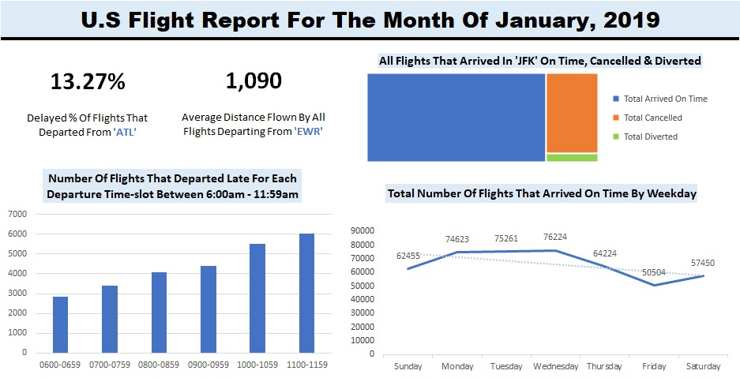

# Flight Analysis 

## Introduction
This assessment aims to evaluate my proficiency in data analysis using **Excel**, as well as my ability to derive actionable insights from complex datasets. Throughout this assessment, I was presented with various challenges that tested my knowledge of Excel's functions, formulas, and data manipulation techniques.

The dataset for this assessment can be accessed from [Link here](https://drive.google.com/file/d/1NbWRCwaQL0-fYAFM0FrGoD3-Hx-ousuT/view?usp=sharing) and contains U.S Flight Data for the month of January 2019. The dataset consists of one table with 583,985 rows and 15 columns

## Skills/ concepts demonstrated:
- Power Query (used to create "Day_Name" column)
- Pivot Table (used to summarize the data)
- Pivot Chart (used to transform the summarized data into compelling visualizations)

## Problem Statements:
1. What percentage of flights that departed from ‘ATL’ were delayed?  

2. Using an appropriate pictorial representation, show the number of flights that arrived on time for each day of the week. (Assume Sunday is the first day of the week).  

3. What is the average distance flown by all flights departing from ‘EWR’?  

4. Using the most appropriate pictorial representation, show the number of flights that departed late for each departure time slot between 0600am till 1159am.  

5. Using an appropriate pictorial representation, show the portion of all flights that arrived in JFK which arrived on time, cancelled or diverted.  

## Dashboard Presentation

## Assessment Summary
The purpose of this assessment was to gauge my expertise in using Excel for data analysis and my capability to extract meaningful insights from intricate datasets. During the assessment, I encountered several tasks that tested my understanding and application of Excel's features. Upon completion, I was able to effectively analyze the data and provide relevant insights based on the challenges presented.

